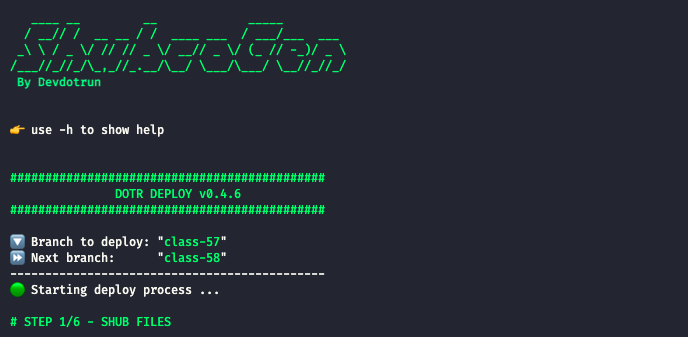

# <!-- SHUBCONFIG --> Hi 😊, welcome to ShubCoGen Template!
## <!-- SHUBCONFIG --> 🏃‍♂️ Run `./init.sh` to configure your project.
## <!-- SHUBCONFIG --> 👉 Access the docs [here](./.shub/README.md)
## <!-- SHUBCONFIG --> 
## <!-- SHUBCONFIG --> <hr>

<a name="readme-top"></a>

# <p align="center">{{ PROJECT_NAME }}</p>

<p align="center">
    
    
    
    
    
    
    
    
    
    
    
    
    
</p>

## 💬 About

This project was developed following {{ COURSE_SOURCE }}'s "[{{ COURSE_NAME }}]({{ COURSE_LINK }})" {{ COURSE_TYPE }}.

Notes taken during the course are in the [notes](notes.md) file.

## :computer: Technologies

- [PHP](https://www.php.net/)
- [Go](https://golang.org/)
- [Node.js](https://nodejs.org/en/)
- [Nginx](https://www.nginx.com/)
- [MySQL](https://www.mysql.com/)
- [Node MySQL2](https://www.npmjs.com/package/mysql2)
- [Docker](https://www.docker.com/)
- [Docker Compose](https://docs.docker.com/compose/)
- [Dockerize](https://github.com/jwilder/dockerize)

<p align="right">(<a href="#readme-top">back to top</a>)</p>

## :scroll: Requirements

- [Docker](https://www.docker.com/)
- [Docker Compose](https://docs.docker.com/compose/)

<p align="right">(<a href="#readme-top">back to top</a>)</p>

## :cd: Installation

```sh
git clone git@github.com:{{ GITHUB_USER }}/{{ PROJECT_REPO_NAME }}.git
```

```sh
cd {{ PROJECT_REPO_NAME }}
```

<p align="right">(<a href="#readme-top">back to top</a>)</p>

## :runner: Running

```sh
make run
```

> Access http://localhost

<p align="right">(<a href="#readme-top">back to top</a>)</p>

<!-- ## :white_check_mark: Tests

After up the container:

```sh
docker-compose exec -t {{ CONTAINER_SERVICE_NAME }} ./vendor/bin/phpunit
```

## Contributing

Pull requests are welcome. For major changes, please open an issue first to discuss what you would like to change.

Please make sure to update tests as appropriate. -->

## :memo: License

[MIT](https://choosealicense.com/licenses/mit/)

<p align="right">(<a href="#readme-top">back to top</a>)</p>

## 🧙‍♂️ About Me

<p align="center">
    <a style="font-weight: bold" href="https://github.com/{{ GITHUB_USER }}/">
    
    </a>
</p>

<p align="right">(<a href="#readme-top">back to top</a>)</p>

## :clap: Acknowledgments

- [AlgoExpert](https://www.algoexpert.io/)
- [ShubcoGen Template™](https://github.com/filipe1309/shubcogen-template)

<p align="right">(<a href="#readme-top">back to top</a>)</p>

---

<p align="center">
    Done with&nbsp;&nbsp;♥️&nbsp;&nbsp;by <a style="font-weight: bold" href="https://github.com/{{ GITHUB_USER }}/">{{ GIT_USERNAME }}</a> 🖖
</p>

---

